# 水下机器人三维视景与监控系统

这是一个基于 Unity 的水下机器人可视化项目，用于同时展示 AUV、ROV 和 USV 的三维运动、路线编辑、车辆状态监控与趋势数据。本文面向第一次接触项目的使用者，重点说明如何打开项目、运行正式场景并完成常用操作。

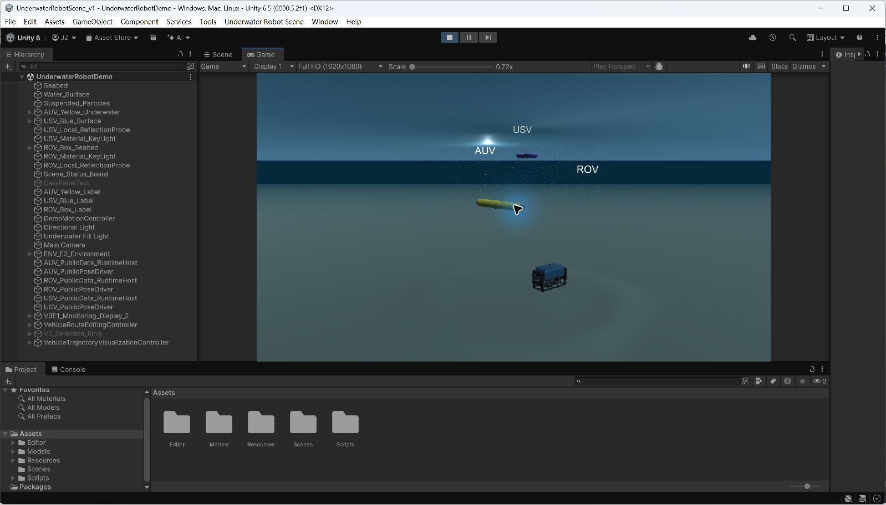

> Display 1 中的正式三维场景：AUV、ROV 与 USV 位于同一水面/水下环境中。

## 建模展示 / Blender 建模成果

项目中的 AUV、ROV 与 USV 均以独立三维模型进入 Unity。下列图片展示当前项目所采用模型的 Blender 视口效果，便于快速了解三类载具的外形、结构和推进器布局。

| AUV 建模效果 | ROV 建模效果 | USV 建模效果 |
| --- | --- | --- |
| 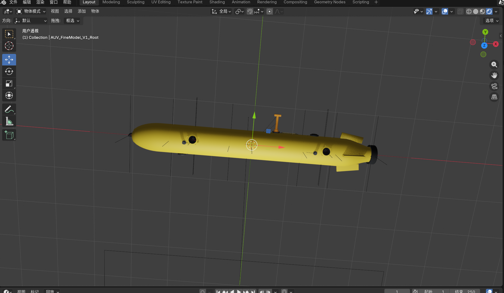 | 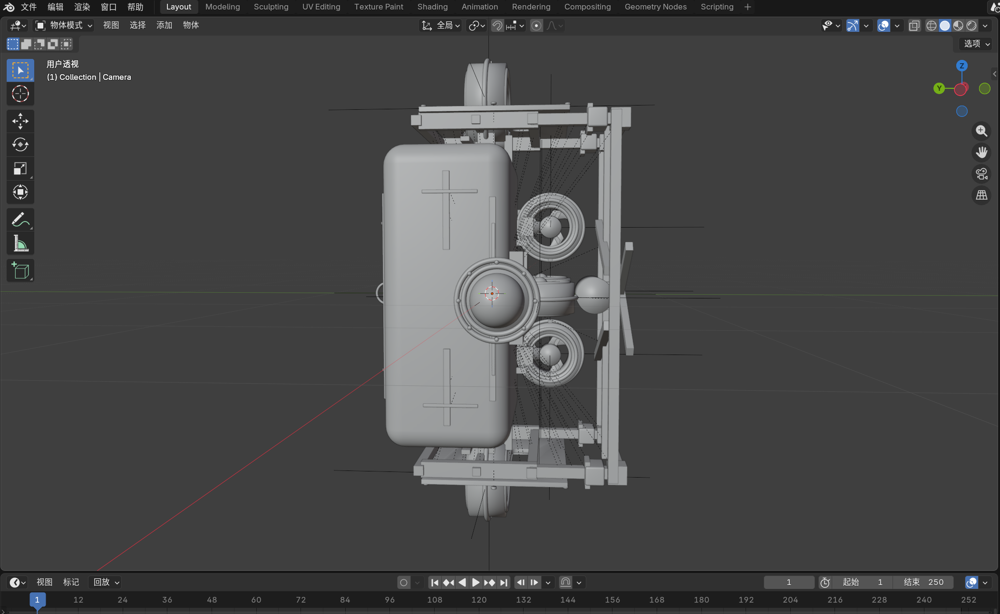 | 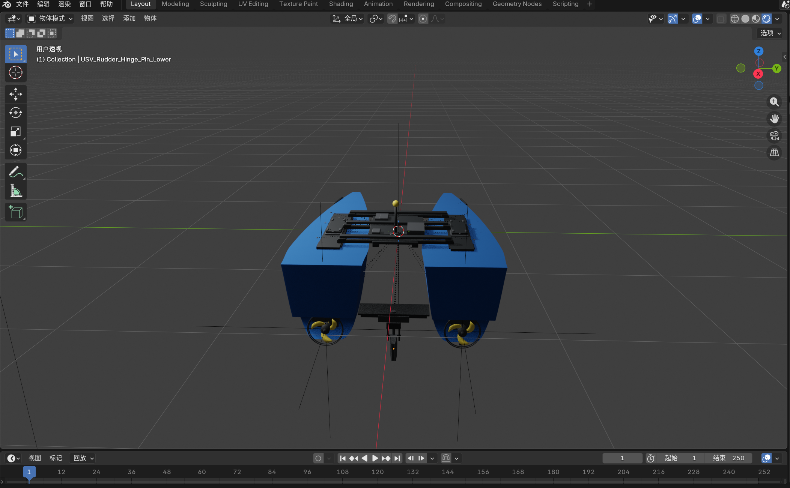 |
| 流线型艇体、尾部推进器及外部传感器布局 | 框架结构、浮力舱和多方向推进器布局 | 双体船体、中央连接结构及尾部推进器布局 |

<details>
<summary>查看模型的补充材质与线框视图</summary>

| AUV 线框视图 | ROV 材质视图 |
| --- | --- |
| 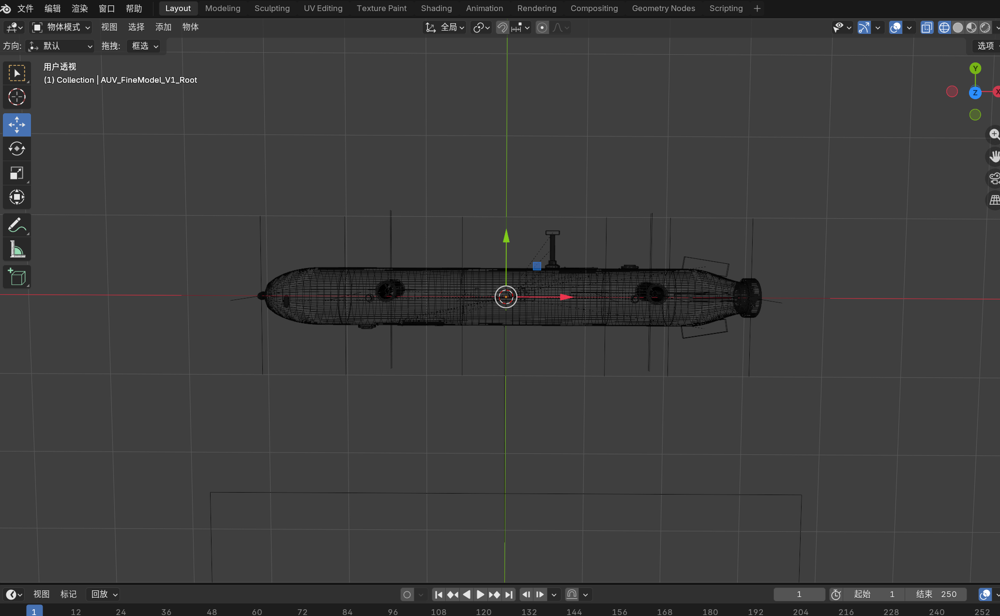 | 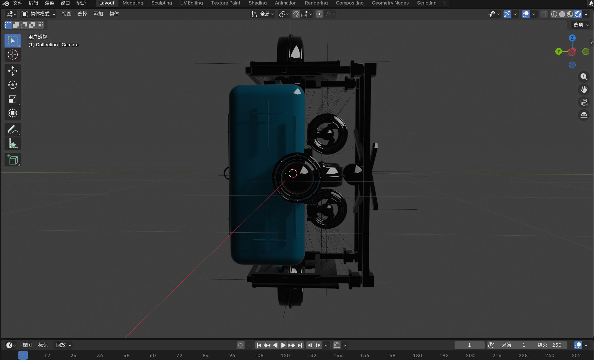 |

| ROV 线框视图 | USV 线框视图 |
| --- | --- |
| 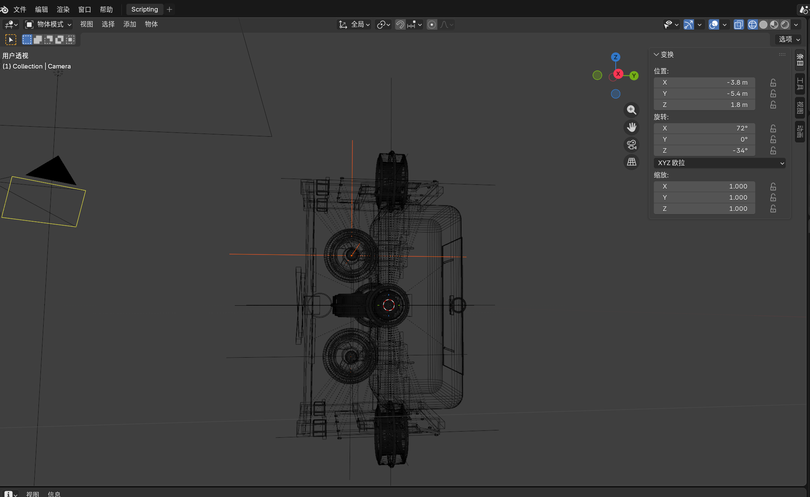 | 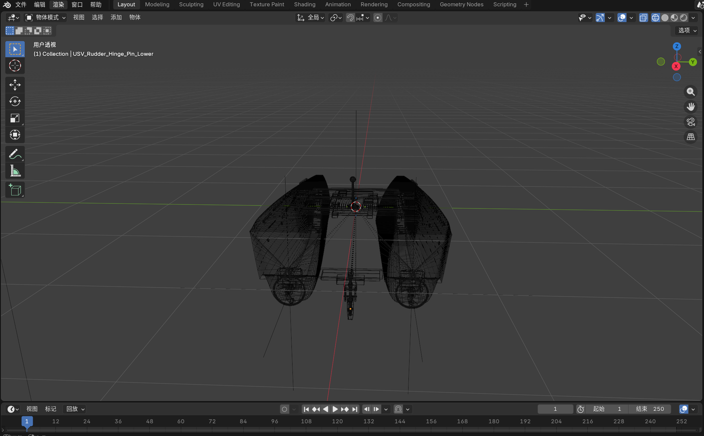 |

</details>

## 1. 环境要求

- Unity Editor：`6000.5.2f1`
- Unity Hub：建议使用，用于添加并打开项目
- Git LFS：必须安装；项目中的正式 FBX 模型由 Git LFS 管理
- 操作系统：项目已在 Windows 环境完成验证；其他平台尚未在本说明中验证
- 显示器：单显示器即可使用；第二台显示器可用于独立显示 Monitoring Dashboard

克隆仓库后，如果 FBX 文件仍显示为很小的 LFS pointer 文本，请先在仓库根目录执行：

```bash
git lfs install
git lfs pull
```

## 2. 正确打开 Unity 项目

仓库根目录不是 Unity Project folder。应当在 Unity Hub 中选择：

```text
UnityProject/UnderwaterRobotScene_v1
```

推荐步骤：

1. 打开 Unity Hub。
2. 选择 `Projects` / `项目`。
3. 选择 `Add` → `Add project from disk`（中文界面通常为“从磁盘添加项目”）。
4. 选择仓库中的 `UnityProject/UnderwaterRobotScene_v1` 文件夹。
5. 确认使用 Unity `6000.5.2f1` 打开。
6. 首次导入时等待 Unity 完成资源导入与脚本编译。

Unity 会在本地生成 `Library`、`Temp`、`Logs`、`UserSettings` 等目录。这些目录不是项目源文件，也不应提交到 Git。

## 3. 正式场景与快速启动

正式运行场景为：

```text
Assets/Scenes/UnderwaterRobotDemo.unity
```

它也是当前 Build Settings 中启用的场景。快速启动步骤：

1. 在 Project 窗口中双击 `Assets/Scenes/UnderwaterRobotDemo.unity`。
2. 打开 Game 视图，并从左上角显示选择器选择 `Display 1`。
3. 点击 Unity 顶部的 Play 按钮。
4. 使用 `1`、`2`、`3` 选择 AUV、ROV、USV，或直接在三维视景中单击车辆。
5. 需要监控页面时，将 Game 视图切换到 `Display 2`。

如果键盘操作没有响应，先单击 Game 视图，让它获得输入焦点。

## 4. Display 1：三维视景

Display 1 是主要操作界面，显示水面、水下环境、三类机器人、车辆标签、选择环、路线、航点和实际运动轨迹。

### 4.1 车辆选择、相机与轨迹

| 操作 | 输入/按钮 | 效果 | 适用车辆 |
| --- | --- | --- | --- |
| 选择 AUV | `1` 或小键盘 `1` | 选择 AUV，并进入该车辆的跟随视角 | AUV |
| 选择 ROV | `2` 或小键盘 `2` | 选择 ROV，并进入该车辆的跟随视角 | ROV |
| 选择 USV | `3` 或小键盘 `3` | 选择 USV，并进入该车辆的跟随视角 | USV |
| 鼠标选择 | 左键单击车辆 | 选择并跟随被单击车辆；Route Editor 编辑模式下不可用 | AUV / ROV / USV |
| 切换跟随 | `F` | 对当前选中车辆开启或关闭跟随 | AUV / ROV / USV |
| 环绕观察 | 按住鼠标右键拖动 | 在跟随状态下环绕当前车辆旋转相机 | AUV / ROV / USV |
| 缩放 | 鼠标滚轮 | 在跟随状态下拉近或拉远相机 | AUV / ROV / USV |
| 显示/隐藏轨迹 | `T` | 切换规划路线、航点和轨迹显示 | AUV / ROV / USV |
| 返回总览 | `Esc` | 非编辑状态下取消车辆选择并返回总览 | AUV / ROV / USV |

选中车辆时，车辆周围会出现绿色选择环；画面同时显示该车辆的 Route Editor 和当前路线。

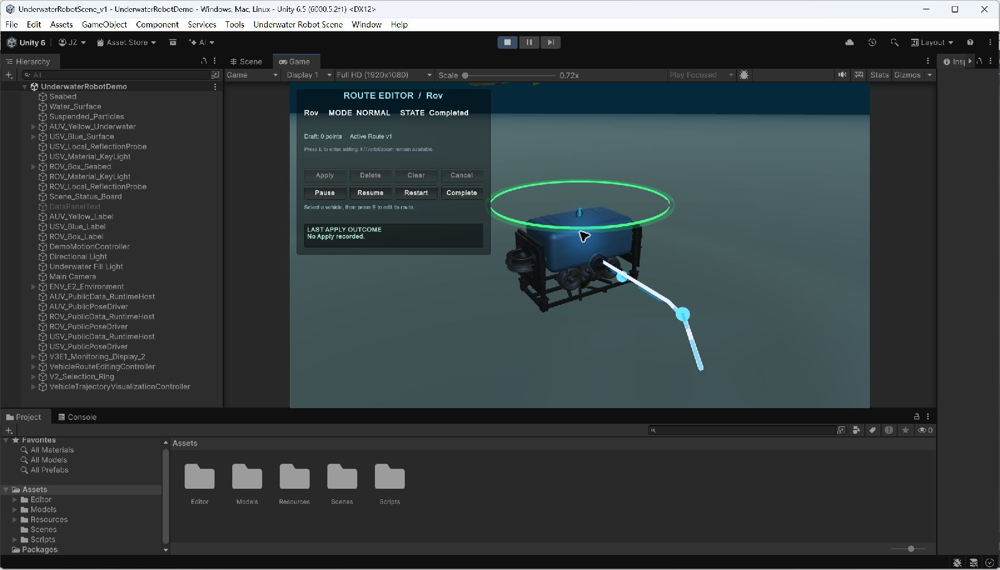

> 选中 ROV 后的跟随视角：绿色圆环表示当前选中车辆，浅色折线和航点表示规划路线。

### 4.2 AUV、ROV 与 USV 的运动语义

三类车辆由路线系统驱动，而不是通过方向键直接驾驶。

| 车辆 | 当前路线运动方式 | 垂向路线 | 当前默认巡航速度 |
| --- | --- | --- | --- |
| AUV | 按三维路线切线运动；渲染姿态可体现航向、俯仰和横滚 | 支持 | `1.25 m/s` |
| ROV | 可沿水平与垂向航点运动；姿态策略保持水平并主要按航向旋转 | 支持 | `0.45 m/s` |
| USV | 在水面按水平路线运动并按航向旋转 | 不支持垂向航点编辑 | `1.50 m/s` |

速度值来自当前默认路线配置；运行时以 Route Editor 和 Dashboard 显示的当前路线数据为准。

### 4.3 AUV 与 USV 运行演示

| AUV 三维路线运行 | USV 水面路线运行 |
| --- | --- |
| 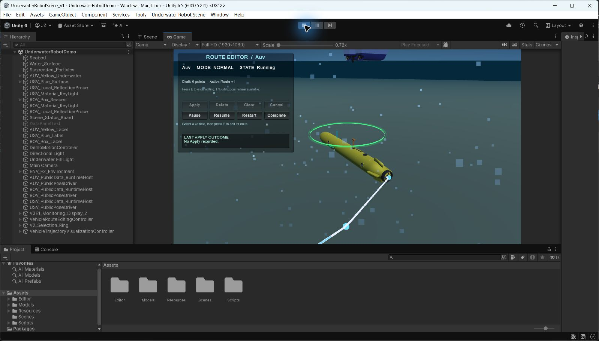 | 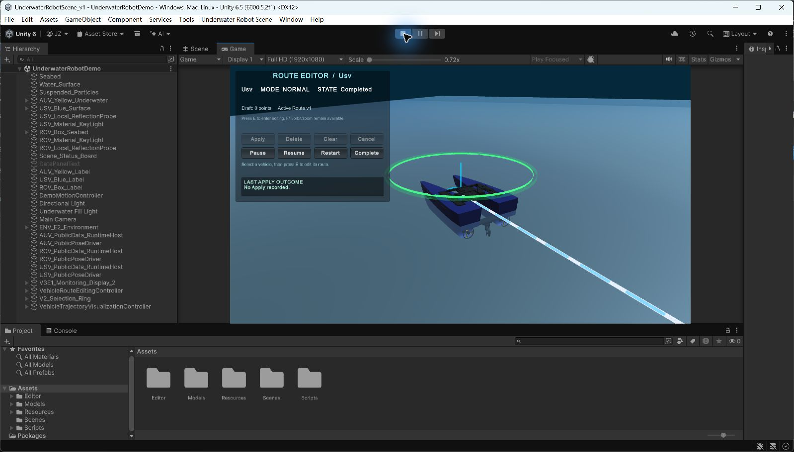 |
| AUV 被选中后沿三维路线运行，可在 Route Editor 中维护包含垂向变化的 waypoint | USV 被选中后沿水面水平路线运行，使用独立的路线和航向控制 |

## 5. Route Editor 与 waypoint 操作

Route Editor 只编辑当前选中车辆。开始前先用 `1`、`2`、`3` 或鼠标选择车辆。

进入编辑模式时，当前 active route 会复制成一个 draft。对航点的增删、拖动和垂向调整先作用于 draft；只有执行 Apply 后，draft 才会成为新的 active route。

| 操作 | 输入/按钮 | 效果 | 适用车辆 |
| --- | --- | --- | --- |
| 进入/退出编辑 | `E` | 进入或退出 Route Editor 编辑模式；用 `E` 退出时保留尚未 Apply 的 draft | AUV / ROV / USV |
| 添加 waypoint | 编辑模式下左键单击空白区域 | 在当前编辑平面添加航点 | AUV / ROV / USV |
| 选择 waypoint | 左键单击航点 | 选择该航点，供拖动、删除或垂向调整 | AUV / ROV / USV |
| 水平拖动 waypoint | 按住左键拖动航点 | 移动航点的水平位置；AUV/ROV 拖动时保留原有 Y | AUV / ROV / USV |
| 提高 waypoint | `PageUp` | 将选中航点的 Unity/world Y 增加 `0.25 m` | AUV / ROV |
| 降低 waypoint | `PageDown` | 将选中航点的 Unity/world Y 减少 `0.25 m` | AUV / ROV |
| 删除 waypoint | `Delete`、`Backspace` 或 `Delete` 按钮 | 删除当前选中的航点 | AUV / ROV / USV |
| 清空 draft | `C` 或 `Clear` 按钮 | 清空当前 draft，不直接改动 active route | AUV / ROV / USV |
| 应用 draft | `Enter`、小键盘 `Enter` 或 `Apply` 按钮 | 校验并发布 draft；有效路线成为新的 active route | AUV / ROV / USV |
| 取消编辑 | `Esc` 或 `Cancel` 按钮 | 丢弃 draft，恢复 active route 并退出编辑模式 | AUV / ROV / USV |
| 暂停/继续 | `P`，或 `Pause` / `Resume` 按钮 | 切换当前路线的暂停与继续 | AUV / ROV / USV |
| 重新执行 | `R` 或 `Restart` 按钮 | 从头重新执行当前路线 | AUV / ROV / USV |
| 标记完成 | `End` 或 `Complete` 按钮 | 将当前路线标记为 Completed | AUV / ROV / USV |

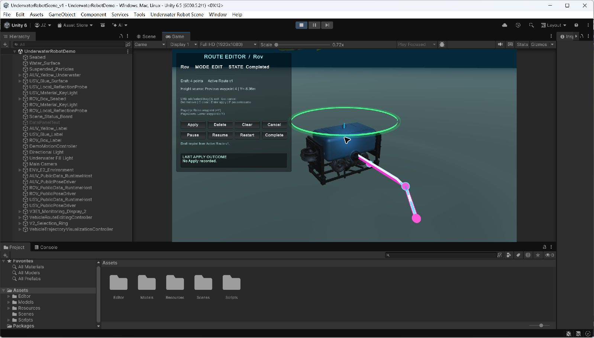

> ROV 的 Route Editor 编辑模式：洋红色为 draft 路线；面板会显示 draft 点数、active route 版本、Y 来源和上次 Apply 结果。

### 5.1 垂向运动的重要说明

README、Route Editor 与 Trends 中出现的 `Vertical Position`、`Vertical Y` 或 `Position Y`，都表示 **Unity/world Y 坐标**，不是物理意义上的水深 `Depth`。

- AUV 和 ROV：先选择一个 waypoint，再用 `PageUp` / `PageDown` 以 `0.25 m` 步长调整 Unity/world Y。
- USV：按水面水平路线运行，不提供垂向航点编辑。
- ROV 可以沿垂向航点移动，但渲染姿态仍采用保持水平、按航向旋转的策略。

## 6. Display 2：Monitoring Dashboard

Display 2 是监控界面。在 Unity Editor 中，可从 Game 视图左上角的 Display 选择器切换到 `Display 2`。如果 Windows Player 运行在连接了第二台物理显示器的电脑上，项目会尝试自动激活第二显示器。

Display 2 有两个页面：

- `Summary`：车辆总览、选中车辆、路线、安全与诊断信息。
- `Trends`：当前选中车辆的时间趋势。

在 Play Mode 中按 `Tab` 可在 Summary 与 Trends 之间切换。

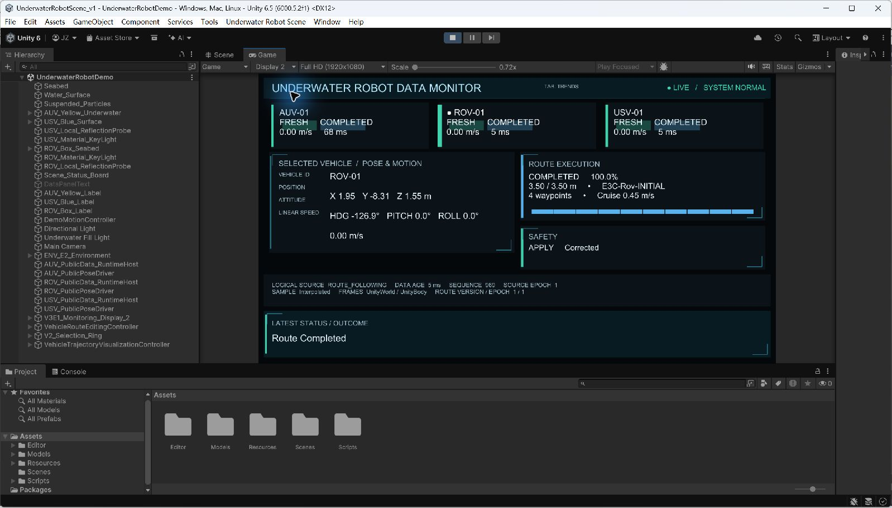

> Monitoring Dashboard 总览：顶部同时显示三辆车，主体区域显示当前选中车辆的位姿、路线、安全和数据源状态。

### 6.1 Dashboard 主要字段

| 区域/字段 | 含义 |
| --- | --- |
| Vehicle ID | 车辆标识，例如 AUV-01、ROV-01、USV-01 |
| Health | 数据健康状态：`Fresh`、`Stale`、`Invalid`、`NoData`、`Disabled` 或 `Unavailable` |
| Route State | 当前路线执行状态，例如 Running、Paused、Hold 或 Completed |
| Speed | 当前线速度，单位 `m/s` |
| Data Age | 当前样本距现在的时间，用于判断数据是否新鲜 |
| Position X / Y / Z | Unity 世界坐标，单位 `m`；其中 Y 是 Unity/world Y，不是物理 Depth |
| HDG / Pitch / Roll | 渲染姿态的航向角、俯仰角与横滚角 |
| Route Progress | 路线完成百分比 |
| Distance / Total Length | 已行进距离与路线总长度，单位 `m` |
| Route ID | 当前路线标识 |
| Waypoint Count | 当前 active route 的航点数量 |
| Cruise Speed | 当前路线配置的巡航速度 |
| Safety | AUV/ROV 的安全判定及原因；USV 的业务安全约束显示为不适用 |
| Logical Source | 当前逻辑数据源模式，例如 `ROUTE_FOLLOWING` 或 `LOCAL_DIAGNOSTIC` |
| Sequence / Source Epoch | 数据样本序号及数据源纪元，用于识别数据连续性 |
| Sample Mode / Frames | 样本模式，以及 world/body 坐标系信息 |
| Route Version / Epoch | 当前路线版本与路线执行纪元 |
| Latest Status / Outcome | 最近一次路线或安全处理的结果说明 |

Dashboard 默认约每 `0.2 s` 刷新一次。选中车辆由 Display 1 的选择状态决定。

## 7. Trend Charts

Trends 页面显示 Display 1 当前选中车辆最近约 `60 s` 的有效数据。只有数据健康状态为 `Fresh` 且带有有效时间戳的样本才会进入趋势历史；数据过期、无效或数据源纪元变化时，曲线会断开，而不会用一条线跨越不连续区间。

| 曲线 | 含义 |
| --- | --- |
| Vertical Position Y (m) | 车辆的 Unity/world Y 坐标；不是物理 Depth |
| Linear Speed (m/s) | 车辆线速度 |
| Rendered Heading (deg) | 当前渲染航向角 |
| Rendered Pitch (deg) | 当前渲染俯仰角 |
| Rendered Roll (deg) | 当前渲染横滚角 |

页面标题区还会显示当前车辆 ID、Source Epoch、Health 和样本数量。

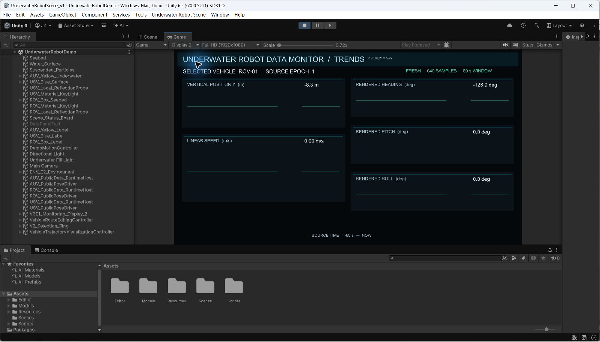

> 当前选中 ROV 的五组趋势：Vertical Position Y、Linear Speed、Rendered Heading、Rendered Pitch 与 Rendered Roll。

## 8. 常见问题

### 为什么打开仓库根目录后 Unity 不识别项目？

Unity Project folder 是 `UnityProject/UnderwaterRobotScene_v1`，不是仓库根目录。请通过 Unity Hub 添加这一子目录。

### 为什么首次打开很慢？

Unity 需要重新生成 `Library` 并导入模型、纹理和脚本。首次导入完成后，后续打开通常会更快。

### 为什么模型缺失或 FBX 文件只有几行文本？

这是 Git LFS 对象没有拉取完整的典型表现。安装 Git LFS 后，在仓库根目录执行 `git lfs pull`，再回到 Unity 等待重新导入。

### 为什么 Display 2 显示 “No cameras rendering”？

确认已经打开 `Assets/Scenes/UnderwaterRobotDemo.unity` 并进入 Play Mode。Monitoring Dashboard 只在正式场景运行时创建。

### 为什么键盘快捷键没有反应？

先单击 Game 视图，让它获得焦点；然后再使用 `1` / `2` / `3`、`E`、`P`、`T`、`Tab` 等快捷键。

### 为什么不能单击另一辆车？

Route Editor 编辑模式会占用主要指针输入。先按 `Esc` 取消 draft，或按 `E` 退出编辑模式，再选择其他车辆。

### 为什么 Apply 没有生效？

Route Editor 只会发布通过校验的 draft。检查 draft 是否包含有效航点，并查看面板中的 `LAST APPLY OUTCOME` 提示。

### 为什么 PageUp / PageDown 没有效果？

必须处于编辑模式、已经选中一个 waypoint，而且当前车辆必须是 AUV 或 ROV。USV 不支持垂向航点编辑。

### Position Y 是水深吗？

不是。它是 Unity/world Y 坐标。项目界面不会把它当作物理 Depth 使用。

## 9. 项目截图索引

- [Display 1 主三维场景](docs/images/main-scene.jpg)
- [AUV Blender 材质视图](docs/images/modeling-auv-material.png)
- [AUV Blender 线框视图](docs/images/modeling-auv-wireframe.png)
- [ROV Blender 实体视图](docs/images/modeling-rov-solid.png)
- [ROV Blender 材质视图](docs/images/modeling-rov-material.png)
- [ROV Blender 线框视图](docs/images/modeling-rov-wireframe.png)
- [USV Blender 材质视图](docs/images/modeling-usv-material.png)
- [USV Blender 线框视图](docs/images/modeling-usv-wireframe.png)
- [AUV 当前运行演示](docs/images/auv-operation.jpg)
- [USV 当前运行演示](docs/images/usv-operation.jpg)
- [ROV 选择与规划轨迹](docs/images/vehicle-selection.jpg)
- [Route Editor 编辑模式](docs/images/route-editor.jpg)
- [Monitoring Dashboard](docs/images/monitoring-dashboard.jpg)
- [Trend Charts](docs/images/trend-charts.jpg)
